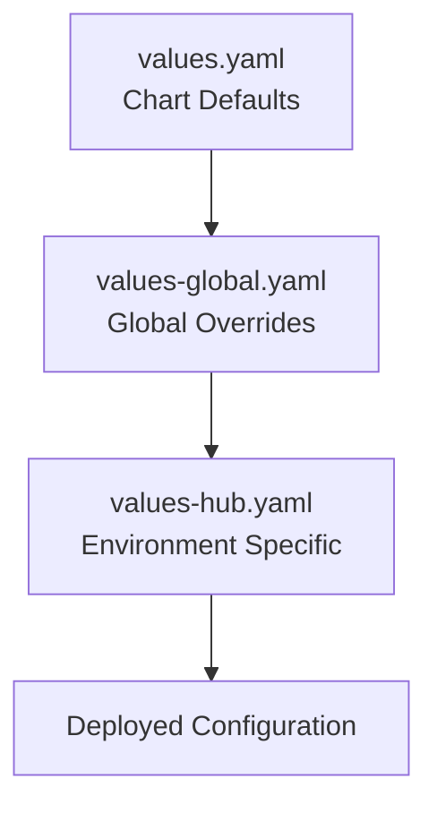
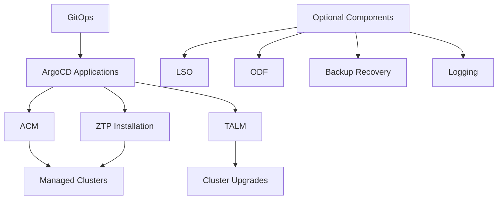

# Telco Hub Validated Pattern

> **A GitOps-based validated pattern for deploying and managing Telco Hub infrastructure using Red Hat OpenShift, Advanced Cluster Management (ACM), and Zero Touch Provisioning (ZTP).**

[](https://www.redhat.com/en/technologies/cloud-computing/openshift)
[](https://validatedpatterns.io/)
[](https://helm.sh/)
[](https://argoproj.github.io/cd/)

---

## 📖 Table of Contents

- [🎯 Overview](#-overview)
- [🏗️ Architecture](#️-architecture)
- [🚀 Quick Start](#-quick-start)
- [⚙️ Configuration](#️-configuration)
- [📦 Components](#-components)
- [🛠️ Operations](#️-operations)
- [🔧 Troubleshooting](#-troubleshooting)
- [📚 Documentation](#-documentation)

---

## 🎯 Overview

The **Telco Hub Validated Pattern** delivers a production-ready, GitOps-based solution for deploying and managing telecommunications hub infrastructure. Built on the [Red Hat Validated Patterns](https://validatedpatterns.io/) framework, this pattern provides:

### ✨ Key Features

- **🔒 Zero-Modification Architecture**: Preserves existing `reference-crs/` configurations unchanged
- **🎛️ Component-Based Deployment**: Enable/disable components via Helm values
- **🚀 GitOps-Native**: Fully automated deployment via ArgoCD
- **📋 Single Source of Truth**: Maintains configuration authority in reference-crs
- **🔄 Lifecycle Management**: Integrated cluster management and upgrade capabilities
- **📊 Observability Ready**: Built-in monitoring and logging options

### 🎯 Use Cases

- **Telco Edge Hub Management**: Deploy and manage multiple edge clusters
- **Zero Touch Provisioning**: Automated cluster installation and configuration
- **Multi-Cluster Operations**: Centralized management of distributed infrastructure
- **GitOps Workflows**: Infrastructure-as-code with automated deployment

---

## 🏗️ Architecture

### Pattern Structure

```
telco-hub/configuration/
├── reference-crs/                      # 📁 Core Configurations (UNCHANGED)
│   ├── required/                       # 🔧 Essential Components
│   │   ├── acm/                        # Advanced Cluster Management
│   │   ├── gitops/                     # GitOps Operators & Configuration
│   │   │   └── ztp-installation/       # Zero Touch Provisioning
│   │   └── talm/                       # Topology Aware Lifecycle Manager
│   └── optional/                       # 🔌 Optional Components
│       ├── lso/                        # Local Storage Operator
│       ├── odf-internal/               # OpenShift Data Foundation
│       ├── backup-recovery/            # Backup & Recovery (Velero/OADP)
│       └── logging/                    # Cluster Logging Stack
└── telco-hub-pattern/                  # 📦 Helm Pattern (THIS)
    ├── charts/all/telco-hub/           # Helm Chart
    │   ├── templates/                  # ArgoCD Application Templates
    │   └── values.yaml                 # Chart Default Values
    ├── values-global.yaml              # Global Configuration
    ├── values-hub.yaml                 # Environment-Specific Config
    ├── docs/                           # 📚 Documentation
    └── Makefile                        # 🛠️ Automation Scripts
```

### Design Principles

| Principle | Description | Benefit |
|-----------|-------------|---------|
| **Reference-Based** | Helm creates ArgoCD Applications pointing to existing paths | No file duplication or modification |
| **GitOps-Native** | ArgoCD manages all deployments and synchronization | Automated, auditable infrastructure changes |
| **Component-Driven** | Modular architecture with enable/disable controls | Deploy only what you need |
| **Validation-First** | Built on Red Hat Validated Patterns framework | Production-tested, enterprise-ready |

---

## 🚀 Quick Start

### Prerequisites

Ensure your environment meets these requirements:

- ✅ **OpenShift 4.14+** cluster with cluster-admin privileges
- ✅ **OpenShift GitOps** operator installed
- ✅ **Helm 3.8+** CLI tool
- ✅ **Git repository** access (public or with credentials configured)
- ✅ **oc CLI** tool configured and authenticated

### 1️⃣ Clone and Configure

```bash
# Clone the repository
git clone https://github.com/your-org/telco-reference.git
cd telco-reference/telco-hub/configuration/telco-hub-pattern

# Copy and customize the values file
cp values-hub.yaml my-values.yaml
```

### 2️⃣ Update Configuration

Edit `my-values.yaml` with your environment-specific settings:

```yaml
# =============================================================================
# Environment Configuration
# =============================================================================
telcoHub:
  # -----------------------------------------------------------------------------
  # IMPORTANT: Update these for your environment
  # -----------------------------------------------------------------------------
  git:
    repoURL: "https://github.com/your-org/telco-reference.git"
    targetRevision: "main"

  # -----------------------------------------------------------------------------
  # Component Selection
  # -----------------------------------------------------------------------------
  components:
    # Required Components (recommended for telco-hub functionality)
    acm:             
      enabled: true                   # Advanced Cluster Management
    gitops:          
      enabled: true                   # GitOps operators and configuration
    talm:            
      enabled: true                   # Topology Aware Lifecycle Manager
    
    # ZTP Workflow (enable for cluster installation management)
    ztpInstallation: 
      enabled: true                   # Zero Touch Provisioning workflow
    
    # Optional Components (enable as needed)
    lso:             
      enabled: false                  # Local Storage Operator
    odf:             
      enabled: false                  # OpenShift Data Foundation
    backupRecovery:  
      enabled: false                  # Backup and Recovery
    logging:         
      enabled: false                  # Cluster Logging
```

### 3️⃣ Deploy the Pattern

```bash
# Validate configuration
make validate

# Deploy using Helm
helm install telco-hub charts/all/telco-hub/ -f my-values.yaml

# OR use the automated script
./pattern.sh install
```

### 4️⃣ Verify Deployment

```bash
# Check Helm deployment
helm list

# Monitor ArgoCD Applications
oc get applications -n openshift-gitops

# Check sync status
make status
```

**🎉 Your Telco Hub is now deploying via GitOps!**

---

## ⚙️ Configuration

### Configuration Hierarchy

The pattern uses a three-tier configuration system:



### Configuration Files

| File | Purpose | When to Use |
|------|---------|-------------|
| `charts/all/telco-hub/values.yaml` | 📄 Chart defaults | Default component settings |
| `values-global.yaml` | 🌍 Global configuration | Cross-environment settings |
| `values-hub.yaml` | 🏭 Environment-specific | Per-environment customization |

### Component Configuration

Components are organized into logical categories:

#### Required Components
Essential for telco hub functionality:
```yaml
components:
  acm:
    enabled: true                     # Multi-cluster management
  gitops:
    enabled: true                     # GitOps operators
  talm:
    enabled: true                     # Lifecycle management
```

#### ZTP Workflow
For automated cluster deployment:
```yaml
components:
  ztpInstallation:
    enabled: true                     # ZTP applications and policies
```

#### Optional Components
Enable based on requirements:
```yaml
components:
  lso:
    enabled: false                    # Local storage
  odf:
    enabled: false                    # Persistent storage
  backupRecovery:
    enabled: false                    # Backup/restore
  logging:
    enabled: false                    # Log aggregation
```

### Advanced Configuration

#### Custom ArgoCD Sync Policy
```yaml
telcoHub:
  argocd:
    syncPolicy:
      automated:
        allowEmpty: true
        prune: true
        selfHeal: true
```

#### Kustomize Patches
Apply environment-specific customizations:
```yaml
telcoHub:
  argocd:
    kustomizePatches:
      - target:
          group: argoproj.io
          version: v1alpha1
          kind: Application
          name: hub-config
        patch: |-
          - op: replace
            path: "/spec/source/repoURL"
            value: "https://your-custom-repo.git"
```

---

## 📦 Components

### Component Reference

| Component | Type | Description | Reference Path |
|-----------|------|-------------|----------------|
| **ACM** | Required | Advanced Cluster Management for multi-cluster operations | `reference-crs/required/acm/` |
| **GitOps** | Required | ArgoCD operators and GitOps configuration | `reference-crs/required/gitops/` |
| **TALM** | Required | Topology Aware Lifecycle Manager for cluster updates | `reference-crs/required/talm/` |
| **ZTP Installation** | Workflow | Zero Touch Provisioning applications and policies | `reference-crs/required/gitops/ztp-installation/` |
| **LSO** | Optional | Local Storage Operator for node-local storage | `reference-crs/optional/lso/` |
| **ODF** | Optional | OpenShift Data Foundation for persistent storage | `reference-crs/optional/odf-internal/` |
| **Backup Recovery** | Optional | Velero/OADP for backup and disaster recovery | `reference-crs/optional/backup-recovery/` |
| **Logging** | Optional | Cluster Logging Operator for log aggregation | `reference-crs/optional/logging/` |

### Component Dependencies



---

## 🛠️ Operations

### Available Commands

The pattern includes a comprehensive Makefile for common operations:

```bash
# 📋 Information
make help                             # Show all available commands
make status                           # Show deployment status
make debug                            # Show configuration debug info

# 🚀 Deployment
make install                          # Deploy the pattern
make upgrade                          # Upgrade existing deployment
make uninstall                        # Remove the pattern

# ✅ Validation
make validate                         # Validate Helm templates
make lint                             # Lint Helm charts
make dry-run                          # Test without applying

# 🔍 Monitoring
make argocd-login                     # Get ArgoCD credentials
make apps                             # List ArgoCD applications
make sync-status                      # Check sync status
```

### Day-2 Operations

#### Enabling Components
```bash
# Enable LSO component
helm upgrade telco-hub charts/all/telco-hub/ \
  --reuse-values \
  --set telcoHub.components.lso.enabled=true

# Enable multiple components
helm upgrade telco-hub charts/all/telco-hub/ \
  --reuse-values \
  --set telcoHub.components.odf.enabled=true \
  --set telcoHub.components.backupRecovery.enabled=true
```

#### Updating Configuration
```bash
# Apply configuration changes
helm upgrade telco-hub charts/all/telco-hub/ -f my-values.yaml

# Update Git repository
helm upgrade telco-hub charts/all/telco-hub/ \
  --reuse-values \
  --set telcoHub.git.targetRevision=new-branch
```

#### Monitoring Deployment
```bash
# Watch ArgoCD applications
watch oc get applications -n openshift-gitops

# Check individual application status
oc describe application telco-hub-acm -n openshift-gitops

# View application logs
oc logs -n openshift-gitops deployment/openshift-gitops-application-controller
```

### Access ArgoCD UI

```bash
# Get ArgoCD route
echo "ArgoCD UI: https://$(oc get route openshift-gitops-server -n openshift-gitops -o jsonpath='{.spec.host}')"

# Get admin password
oc extract secret/openshift-gitops-cluster -n openshift-gitops --to=-
```

---

## 🔧 Troubleshooting

### Common Issues

#### 1. Git Repository Access
**Problem**: ArgoCD cannot access the Git repository
```bash
# Check repository URL
oc get application telco-hub-gitops -n openshift-gitops -o yaml | grep repoURL

# Test repository access
git clone <your-repo-url>
```
**Solution**: Verify repository URL and configure Git credentials if needed

#### 2. Component Sync Failures
**Problem**: ArgoCD applications showing sync errors
```bash
# Check application status
oc get applications -n openshift-gitops -o wide

# View detailed status
oc describe application <app-name> -n openshift-gitops
```
**Solution**: Check referenced paths exist and review application logs

#### 3. Missing Dependencies
**Problem**: Operators or CRDs not available
```bash
# Check operator status
oc get csv -A | grep -E "(acm|gitops|talm)"

# Check CRDs
oc get crd | grep -E "(cluster|application)"
```
**Solution**: Ensure required operators are installed and available

### Debug Commands

```bash
# Comprehensive status check
make debug

# Validate Helm templates
helm template telco-hub charts/all/telco-hub/ -f my-values.yaml | kubectl apply --dry-run=client -f -

# Check ArgoCD controller logs
oc logs -n openshift-gitops deployment/openshift-gitops-application-controller -f

# Test individual component
helm template telco-hub charts/all/telco-hub/ -f my-values.yaml -s templates/acm.yaml
```

### Support Resources

- 📖 [Getting Started Guide](docs/getting-started.md)
- 🏗️ [Architecture Documentation](docs/README.md)
- 🔍 [Red Hat Validated Patterns](https://validatedpatterns.io/)
- 💬 [OpenShift GitOps Documentation](https://docs.openshift.com/container-platform/latest/cicd/gitops/understanding-openshift-gitops.html)

---

## 📚 Documentation

### Quick Links

| Document | Description |
|----------|-------------|
| [Getting Started](docs/getting-started.md) | Complete setup and deployment guide |
| [Architecture Overview](docs/README.md) | Detailed architecture and design documentation |

### External Resources

- [Red Hat Validated Patterns](https://validatedpatterns.io/learn)
- [OpenShift GitOps](https://docs.openshift.com/container-platform/latest/cicd/gitops/understanding-openshift-gitops.html)
- [Advanced Cluster Management](https://access.redhat.com/documentation/en-us/red_hat_advanced_cluster_management_for_kubernetes/)
- [Zero Touch Provisioning](https://docs.openshift.com/container-platform/latest/scalability_and_performance/ztp_far_edge/ztp-deploying-far-edge-clusters-at-scale.html)

---

<div align="center">

**🚀 Ready to deploy your Telco Hub?**

[Get Started](docs/getting-started.md) • [View Architecture](docs/README.md) • [Report Issues](https://github.com/your-org/telco-reference/issues)

---

*Built with ❤️ by the Red Hat Telco Team*

</div>
