# Telco Hub Validated Pattern - Architecture Documentation

> **Technical deep-dive into the Telco Hub Pattern architecture, design principles, and implementation details.**

---

## 📖 Table of Contents

- [🏗️ Architecture Overview](#️-architecture-overview)
- [🎨 Design Principles](#-design-principles)
- [🔧 Component Architecture](#-component-architecture)
- [📊 Data Flow](#-data-flow)
- [🚀 GitOps Workflow](#-gitops-workflow)
- [🔄 Configuration Management](#-configuration-management)
- [🛡️ Security Model](#️-security-model)
- [📈 Scalability & Performance](#-scalability--performance)
- [🔌 Extension Points](#-extension-points)

---

## 🏗️ Architecture Overview

### High-Level Architecture

The Telco Hub Validated Pattern implements a **reference-based GitOps architecture** that preserves existing configurations while providing enterprise-grade deployment and management capabilities.

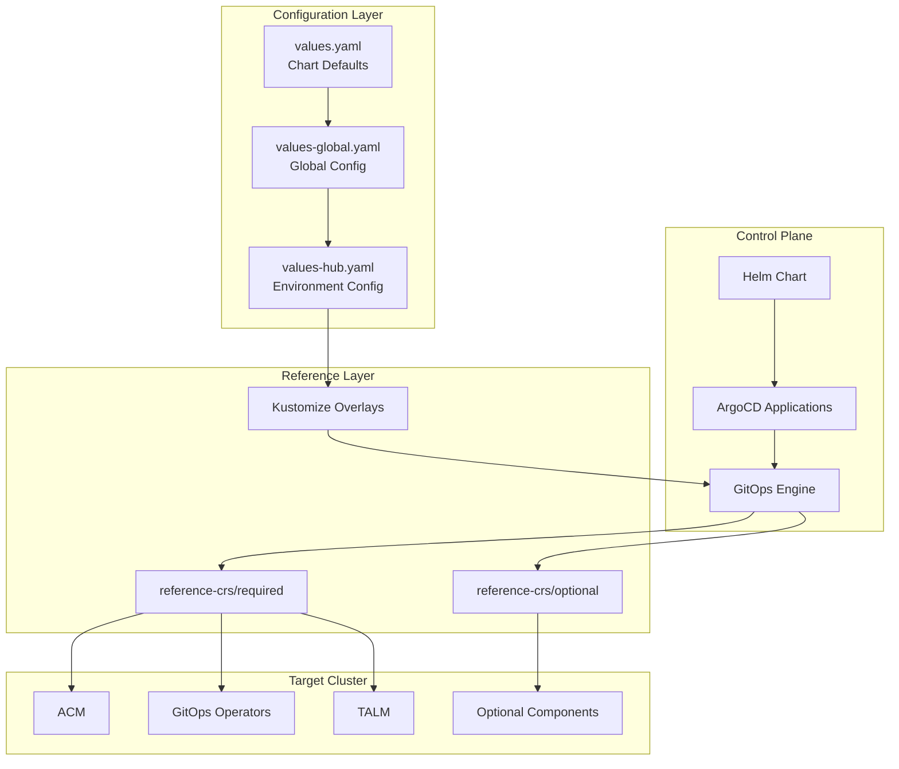

### Core Components

| Component | Role | Responsibility |
|-----------|------|----------------|
| **Helm Chart** | Orchestrator | Creates and manages ArgoCD Applications |
| **ArgoCD Applications** | Deployment Engine | Deploys and syncs Kubernetes resources |
| **Reference CRs** | Configuration Source | Contains all component configurations |
| **Values Hierarchy** | Configuration Management | Provides environment-specific customization |
| **Kustomize Patches** | Customization Layer | Applies environment-specific modifications |

---

## 🎨 Design Principles

### 1. Reference-Based Architecture

**Principle**: Never modify existing configuration files; only reference them.

```yaml
# ArgoCD Application pointing to existing configuration
apiVersion: argoproj.io/v1alpha1
kind: Application
metadata:
  name: telco-hub-acm
spec:
  source:
    repoURL: https://github.com/your-org/telco-reference.git
    path: telco-hub/configuration/reference-crs/required/acm  # REFERENCE ONLY
    targetRevision: main
```

**Benefits**:
- ✅ Zero file duplication
- ✅ Existing configurations remain authoritative
- ✅ No merge conflicts between pattern and configurations
- ✅ Clear separation of concerns

### 2. GitOps-Native Implementation

**Principle**: All deployments are managed through GitOps workflows.

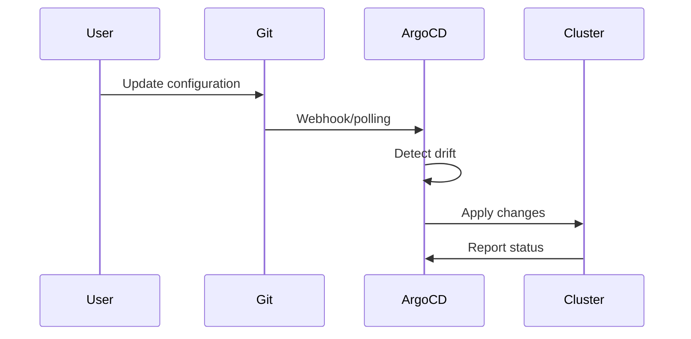

**Benefits**:
- ✅ Auditable deployments
- ✅ Automated synchronization
- ✅ Declarative state management
- ✅ Rollback capabilities

### 3. Component-Driven Design

**Principle**: Enable modular deployment with fine-grained control.

```yaml
# Component configuration matrix
components:
  # Required stack
  acm: { enabled: true, path: "reference-crs/required/acm/" }
  gitops: { enabled: true, path: "reference-crs/required/gitops/" }
  talm: { enabled: true, path: "reference-crs/required/talm/" }
  
  # Optional stack
  lso: { enabled: false, path: "reference-crs/optional/lso/" }
  odf: { enabled: false, path: "reference-crs/optional/odf-internal/" }
```

**Benefits**:
- ✅ Deploy only what you need
- ✅ Reduced resource consumption
- ✅ Simplified troubleshooting
- ✅ Environment-specific flexibility

### 4. Configuration Hierarchy

**Principle**: Layered configuration with clear precedence rules.

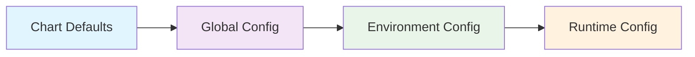

**Precedence Order**: Environment > Global > Chart Defaults

---

## 🔧 Component Architecture

### Required Components Stack

#### Advanced Cluster Management (ACM)
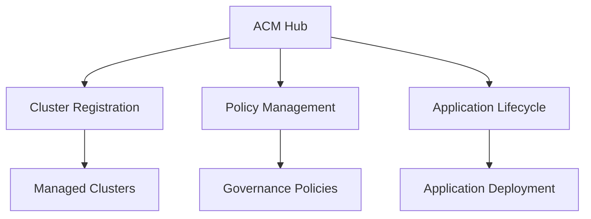

**Key Functions**:
- Multi-cluster management and registration
- Policy-based governance and compliance
- Application lifecycle management
- Cluster observability and monitoring

#### GitOps Operators
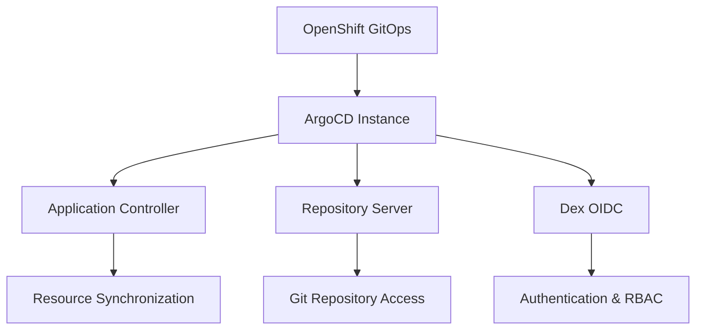

**Key Functions**:
- ArgoCD operator and instance management
- Git repository integration
- Application deployment and synchronization
- RBAC and security integration

#### Topology Aware Lifecycle Manager (TALM)
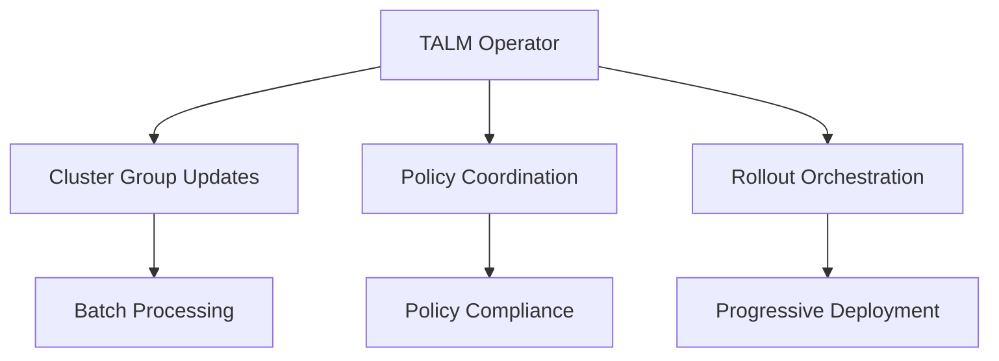

**Key Functions**:
- Cluster lifecycle management
- Coordinated cluster updates
- Policy-driven rollouts
- Topology-aware scheduling

### Optional Components Stack

#### Storage Components
- **LSO**: Local storage provisioning and management
- **ODF**: Software-defined storage for persistent workloads

#### Security & Compliance
- **Backup Recovery**: Disaster recovery and data protection

#### Observability
- **Logging**: Centralized log aggregation and forwarding

---

## 📊 Data Flow

### Configuration Flow

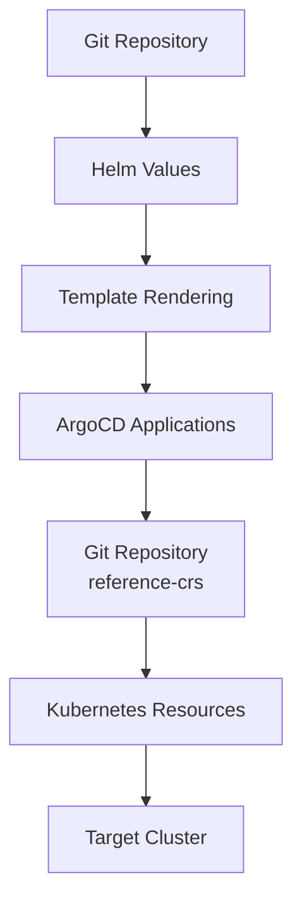

### Deployment Flow

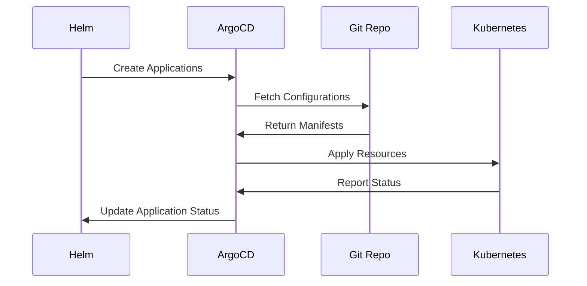

### Update Flow

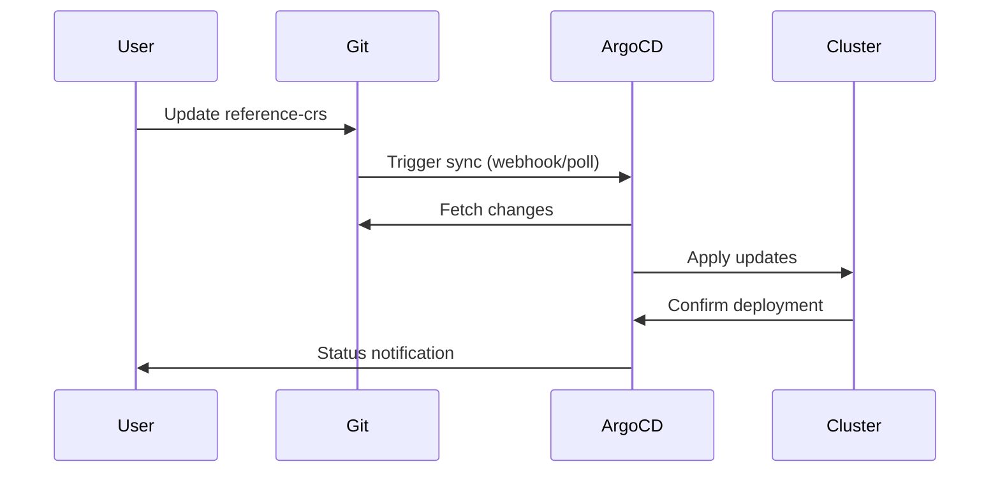

---

## 🚀 GitOps Workflow

### Application Lifecycle

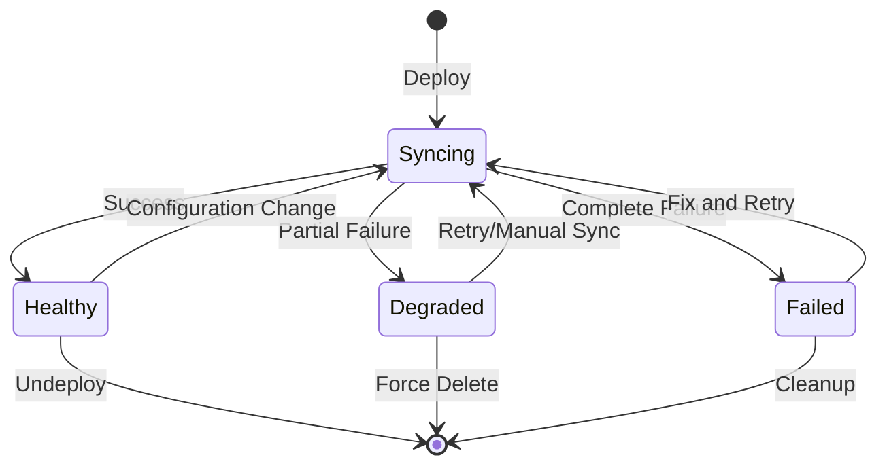

### Sync Policies

#### Automatic Sync (Default)
```yaml
syncPolicy:
  automated:
    allowEmpty: true        # Allow empty directories
    prune: true            # Remove orphaned resources
    selfHeal: true         # Automatically fix drift
```

#### Manual Sync (Conservative)
```yaml
syncPolicy:
  automated: null          # Disable automatic sync
  syncOptions:
    - CreateNamespace=true # Create namespaces if needed
    - RespectIgnoreDifferences=true
```

### Conflict Resolution

1. **Detection**: ArgoCD detects configuration drift
2. **Analysis**: Compare desired vs actual state
3. **Resolution**: Apply corrections based on sync policy
4. **Notification**: Report status and any conflicts

---

## 🔄 Configuration Management

### Values Hierarchy Implementation

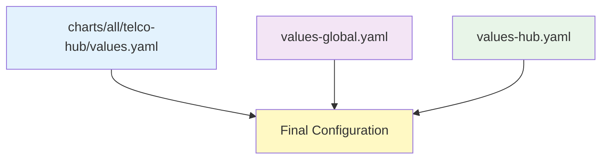

#### Chart Defaults (values.yaml)
```yaml
# Provides base configuration for all environments
global:
  pattern: telco-hub
  namespace: telco-hub-pattern

telcoHub:
  components:
    acm:
      enabled: true          # Default: enabled
    gitops:
      enabled: true          # Default: enabled
    lso:
      enabled: false         # Default: disabled
```

#### Global Configuration (values-global.yaml)
```yaml
# Organization-wide overrides
global:
  hubClusterDomain: "apps.production.example.com"
  repoURL: "https://git.enterprise.com/telco/telco-reference.git"

# Global component policies
# telcoHub:
#   components:
```

#### Environment Configuration (values-hub.yaml)
```yaml
# Environment-specific customization
telcoHub:
  git:
    repoURL: "https://git.dev.example.com/telco-reference.git"
    targetRevision: "feature-branch"
  
  components:
    lso:
      enabled: true          # Enable for this environment
    
  argocd:
    kustomizePatches:        # Environment-specific patches
      - target: { ... }
        patch: |
          # Custom modifications
```

### Kustomize Integration

The pattern supports kustomize patches for fine-grained customization:

```yaml
telcoHub:
  argocd:
    kustomizePatches:
      - target:
          group: argoproj.io
          version: v1alpha1
          kind: Application
          name: hub-config
        patch: |-
          - op: replace
            path: "/spec/source/repoURL"
            value: "https://custom-repo.git"
          - op: add
            path: "/spec/source/directory"
            value:
              recurse: true
              exclude: "*.tmp"
```

---

## 🛡️ Security Model

### RBAC Architecture

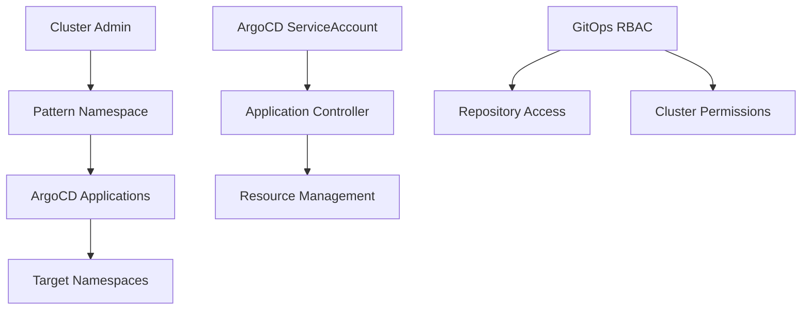

### Security Boundaries

| Component | Namespace | Permissions | Scope |
|-----------|-----------|-------------|-------|
| **Helm Chart** | `openshift-gitops` | Create Applications | ArgoCD Applications only |
| **ArgoCD Applications** | Various | Manage Resources | Component-specific namespaces |
| **GitOps Operator** | `openshift-gitops` | Cluster Admin | Full cluster (managed by operator) |

### Secrets Management

#### Git Repository Access
```yaml
# ArgoCD Repository Secret
apiVersion: v1
kind: Secret
metadata:
  name: telco-reference-repo
  namespace: openshift-gitops
type: Opaque
data:
  type: git
  url: <repository-url>
  username: <base64-username>
  password: <base64-token>
```

#### External Secrets Integration
The pattern supports integration with external secret management systems:

- **HashiCorp Vault**: Via External Secrets Operator
- **Azure Key Vault**: Via CSI driver
- **AWS Secrets Manager**: Via External Secrets Operator

---

## 📈 Scalability & Performance

### Resource Utilization

#### Minimal Configuration
```yaml
# Core components only
components:
  acm: { enabled: true }      # ~500MB memory
  gitops: { enabled: true }   # ~200MB memory
  talm: { enabled: true }     # ~100MB memory
# Total: ~800MB memory, 0.5 CPU cores
```

#### Full Stack Configuration
```yaml
# All components enabled
components:
  acm: { enabled: true }           # ~500MB memory
  gitops: { enabled: true }        # ~200MB memory
  talm: { enabled: true }          # ~100MB memory
  lso: { enabled: true }           # ~50MB memory
  odf: { enabled: true }           # ~2GB memory
  backupRecovery: { enabled: true } # ~300MB memory
  logging: { enabled: true }       # ~1GB memory
# Total: ~4.15GB memory, 2 CPU cores
```

### Performance Characteristics

#### Deployment Times
- **Core Components**: 5-10 minutes
- **Full Stack**: 15-25 minutes
- **Individual Component**: 2-5 minutes

#### Sync Performance
- **Configuration Changes**: 30-60 seconds
- **Large-scale Updates**: 2-5 minutes
- **Error Recovery**: 1-3 minutes

### Scaling Considerations

#### Multi-Cluster Management
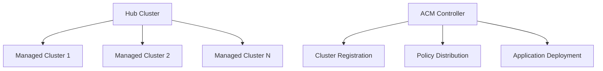

**Scale Limits**:
- **Managed Clusters**: 2000+ per hub
- **Applications per Cluster**: 500+
- **Policies per Cluster**: 100+

---

## 🔌 Extension Points

### Custom Components

#### Adding New Components

1. **Create Component Template**:
```yaml
# templates/custom-component.yaml
{{- if .Values.telcoHub.components.customComponent.enabled }}
apiVersion: argoproj.io/v1alpha1
kind: Application
metadata:
  name: {{ .Values.global.pattern }}-custom-component
spec:
  source:
    path: telco-hub/configuration/reference-crs/optional/custom-component
# ... rest of template
{{- end }}
```

2. **Add Values Configuration**:
```yaml
# values.yaml
components:
  customComponent:
    enabled: false
```

3. **Create Reference Configuration**:
```bash
mkdir -p reference-crs/optional/custom-component
# Add your Kubernetes manifests
```

### Custom Sync Policies

#### Per-Component Sync Policy
```yaml
telcoHub:
  components:
    acm:
      enabled: true
      syncPolicy:
        automated:
          prune: false        # Never auto-prune ACM resources
```

### Integration Hooks

#### Pre/Post Deployment Hooks
```yaml
# Using ArgoCD hooks
apiVersion: batch/v1
kind: Job
metadata:
  annotations:
    argocd.argoproj.io/hook: PreSync
    argocd.argoproj.io/hook-delete-policy: BeforeHookCreation
spec:
  template:
    spec:
      containers:
      - name: pre-deployment-check
        image: custom-validation:latest
        command: ["/scripts/validate-cluster.sh"]
```

### Monitoring Integration

#### Custom Metrics
```yaml
# ServiceMonitor for pattern metrics
apiVersion: monitoring.coreos.com/v1
kind: ServiceMonitor
metadata:
  name: telco-hub-pattern-metrics
spec:
  selector:
    matchLabels:
      app.kubernetes.io/part-of: telco-hub-pattern
```

---

<div align="center">

**📚 Ready for hands-on implementation?**

[Getting Started Guide](getting-started.md) • [Main Documentation](../README.md) • [Component Reference](../README.md#components)

---

*Architecture documentation for Telco Hub Validated Pattern*

</div>
