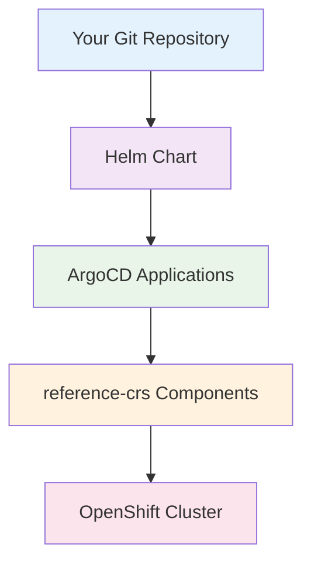

# Getting Started with Telco Hub Validated Pattern

> **Complete step-by-step guide to deploy and configure the Telco Hub Validated Pattern in your OpenShift environment.**

---

## 📖 Table of Contents

- [🎯 Overview](#-overview)
- [✅ Prerequisites](#-prerequisites)
- [🔧 Environment Preparation](#-environment-preparation)
- [⚙️ Configuration](#️-configuration)
- [🚀 Installation](#-installation)
- [✅ Verification](#-verification)
- [🛠️ Day-2 Operations](#️-day-2-operations)
- [🔧 Troubleshooting](#-troubleshooting)
- [📚 Next Steps](#-next-steps)

---

## 🎯 Overview

The Telco Hub Validated Pattern provides a production-ready, GitOps-based solution for deploying telecommunications hub infrastructure. This guide will walk you through the complete process from prerequisites to a running telco hub environment.

### What You'll Deploy

By the end of this guide, you'll have a fully functional telco hub with:

- ✅ **Advanced Cluster Management (ACM)** for multi-cluster operations
- ✅ **GitOps operators** with ArgoCD for automated deployments
- ✅ **Topology Aware Lifecycle Manager (TALM)** for cluster management
- ✅ **Zero Touch Provisioning (ZTP)** capabilities (optional)
- ✅ **Optional components** based on your requirements

### Deployment Architecture



---

## ✅ Prerequisites

### System Requirements

#### OpenShift Cluster
- **Version**: OpenShift 4.14 or later
- **Size**: Minimum 3 master nodes, 2+ worker nodes
- **Resources**: 
  - Master nodes: 8 vCPU, 32GB RAM each
  - Worker nodes: 16 vCPU, 64GB RAM each (for full stack)
- **Storage**: 500GB+ available storage
- **Network**: Internet connectivity for operator installations

#### Local Tools
```bash
# Required CLI tools
oc version              # OpenShift CLI 4.14+
helm version            # Helm 3.8+
git --version           # Git 2.x+

# Optional but recommended
jq --version            # JSON processing
yq --version            # YAML processing
```

#### Access Requirements
- **Cluster Admin**: Full administrative privileges on OpenShift cluster
- **Git Repository**: Read access to your telco-reference repository
- **Container Registry**: Access to Red Hat registry (registry.redhat.io)

### Required Operators

Ensure these operators are installed before deploying the pattern:

#### 1. OpenShift GitOps Operator
```bash
# Check if GitOps operator is installed
oc get csv -n openshift-gitops-operator | grep gitops

# Install if not present
cat << EOF | oc apply -f -
apiVersion: operators.coreos.com/v1alpha1
kind: Subscription
metadata:
  name: openshift-gitops-operator
  namespace: openshift-operators
spec:
  channel: latest
  installPlanApproval: Automatic
  name: openshift-gitops-operator
  source: redhat-operators
  sourceNamespace: openshift-marketplace
EOF
```

#### 2. Verify GitOps Installation
```bash
# Wait for GitOps operator to be ready
oc wait --for=condition=Available deployment/openshift-gitops-application-controller -n openshift-gitops --timeout=300s

# Verify ArgoCD instance is running
oc get argocd -n openshift-gitops
```

---

## 🔧 Environment Preparation

### 1. Repository Access

#### Clone the Repository
```bash
# Clone your telco-reference repository
git clone https://github.com/your-org/telco-reference.git
cd telco-reference/telco-hub/configuration/telco-hub-pattern

# Verify pattern structure
ls -la
# Should show: charts/, docs/, values-*.yaml, Makefile, etc.
```

#### Verify Reference Configurations
```bash
# Ensure reference-crs exist
ls -la ../reference-crs/required/
# Should show: acm/, gitops/, talm/

ls -la ../reference-crs/optional/
# Should show: lso/, odf-internal/, backup-recovery/, logging/
```

### 2. Cluster Preparation

#### Verify Cluster Status
```bash
# Check cluster health
oc get nodes
oc get clusterversion

# Verify sufficient resources
oc describe nodes | grep -A 5 "Allocated resources"
```

#### Configure Image Registry (if needed)
```bash
# For disconnected environments, configure image registry
oc patch configs.imageregistry.operator.openshift.io cluster --type merge --patch '{"spec":{"managementState":"Managed","storage":{"emptyDir":{}}}}'
```

### 3. Permissions Setup

#### Verify Cluster Admin Access
```bash
# Test cluster admin permissions
oc auth can-i create namespaces
oc auth can-i create clusterroles
oc auth can-i create crds
```

---

## ⚙️ Configuration

### 1. Create Custom Values File

```bash
# Copy the example values file
cp values-hub.yaml my-environment.yaml
```

### 2. Configure Git Repository

Edit `my-environment.yaml` and update the Git configuration:

```yaml
# =============================================================================
# IMPORTANT: Update these values for your environment
# =============================================================================
telcoHub:
  git:
    repoURL: "https://github.com/your-org/telco-reference.git"
    targetRevision: "main"  # or your target branch
```

### 3. Select Components

Configure which components to deploy based on your requirements:

#### Minimal Configuration (Hub Only)
```yaml
telcoHub:
  components:
    # Required for basic telco hub functionality
    acm:
      enabled: true                   # Advanced Cluster Management
    gitops:
      enabled: true                   # GitOps operators
    talm:
      enabled: true                   # Lifecycle management
    
    # ZTP workflow (disable if not managing clusters)
    ztpInstallation:
      enabled: false                  # ZTP Applications
    
    # Optional components (start with minimal setup)
    lso:
      enabled: false
    odf:
      enabled: false
    backupRecovery:
      enabled: false
    logging:
      enabled: false
```

#### Full Stack Configuration
```yaml
telcoHub:
  components:
    # Required components
    acm:
      enabled: true
    gitops:
      enabled: true
    talm:
      enabled: true
    
    # ZTP workflow
    ztpInstallation:
      enabled: true                   # Enable if managing cluster deployments
    
    # Optional components (enable based on needs)
    lso:
      enabled: true                   # Local storage
    odf:
      enabled: true                   # Persistent storage
    backupRecovery:
      enabled: true                   # Backup/restore
    logging:
      enabled: true                   # Log aggregation
```

### 4. Advanced Configuration (Optional)

#### Custom ArgoCD Sync Policy
```yaml
telcoHub:
  argocd:
    syncPolicy:
      automated:
        allowEmpty: true
        prune: true                   # Auto-remove orphaned resources
        selfHeal: true                # Auto-correct configuration drift
      syncOptions:
        - CreateNamespace=true        # Auto-create namespaces
        - RespectIgnoreDifferences=true
        - ApplyOutOfSyncOnly=true
      retry:
        limit: 5
        backoff:
          duration: 5s
          factor: 2
          maxDuration: 3m
```

#### Environment-Specific Kustomize Patches
```yaml
telcoHub:
  argocd:
    kustomizePatches:
      - target:
          group: argoproj.io
          version: v1alpha1
          kind: Application
          name: hub-config
        patch: |-
          - op: replace
            path: "/spec/source/repoURL"
            value: "https://your-custom-repo.git"
```

---

## 🚀 Installation

### 1. Pre-Installation Validation

```bash
# Validate configuration syntax
make validate

# Check prerequisites
make check

# Dry-run to see what will be deployed
make dry-run
```

### 2. Deploy the Pattern

#### Option A: Using Make (Recommended)
```bash
# Deploy with custom values file
make install VALUES_FILE=my-environment.yaml

# Monitor deployment
make status
```

#### Option B: Using Helm Directly
```bash
# Install the pattern
helm install telco-hub charts/all/telco-hub/ \
  --values my-environment.yaml \
  --namespace openshift-gitops \
  --create-namespace

# Check deployment status
helm list -n openshift-gitops
```

#### Option C: Using Pattern Script
```bash
# Make the script executable
chmod +x pattern.sh

# Install with custom values
./pattern.sh install my-environment.yaml
```

### 3. Monitor Initial Deployment

```bash
# Watch ArgoCD Applications being created
watch oc get applications -n openshift-gitops

# Check specific application status
oc get application telco-hub-acm -n openshift-gitops -o yaml

# Monitor sync progress
oc get applications -n openshift-gitops -o custom-columns="NAME:.metadata.name,SYNC:.status.sync.status,HEALTH:.status.health.status"
```

---

## ✅ Verification

### 1. Verify Pattern Deployment

#### Check Helm Release
```bash
# Verify Helm release is deployed
helm list -n openshift-gitops | grep telco-hub

# Get release details
helm get values telco-hub -n openshift-gitops
```

#### Check ArgoCD Applications
```bash
# List all telco-hub applications
oc get applications -n openshift-gitops | grep telco-hub

# Check application sync status
for app in $(oc get applications -n openshift-gitops --no-headers | grep telco-hub | awk '{print $1}'); do
  echo "=== $app ==="
  oc get application $app -n openshift-gitops -o jsonpath='{.status.sync.status}' && echo
  oc get application $app -n openshift-gitops -o jsonpath='{.status.health.status}' && echo
  echo
done
```

### 2. Verify Component Deployment

#### Advanced Cluster Management (ACM)
```bash
# Check ACM namespace and pods
oc get pods -n open-cluster-management

# Verify MultiClusterHub
oc get multiclusterhub -n open-cluster-management

# Check ACM console access
echo "ACM Console: https://$(oc get route multicloud-console -n open-cluster-management -o jsonpath='{.spec.host}')"
```

#### GitOps Operators
```bash
# Check GitOps pods
oc get pods -n openshift-gitops

# Verify ArgoCD instance
oc get argocd -n openshift-gitops

# Get ArgoCD console access
echo "ArgoCD Console: https://$(oc get route openshift-gitops-server -n openshift-gitops -o jsonpath='{.spec.host}')"
echo "Admin Password: $(oc extract secret/openshift-gitops-cluster -n openshift-gitops --to=- 2>/dev/null)"
```

#### TALM Operator
```bash
# Check TALM namespace and pods
oc get pods -n openshift-operators | grep cluster-group-upgrades

# Verify TALM CRDs
oc get crd | grep clustergroupupgrades
```

### 3. Verify Optional Components

#### Local Storage Operator (if enabled)
```bash
oc get pods -n openshift-local-storage
oc get localvolumes -A
```

#### OpenShift Data Foundation (if enabled)
```bash
oc get pods -n openshift-storage
oc get storagecluster -n openshift-storage
```

### 4. End-to-End Verification

#### Test GitOps Workflow
```bash
# Create a test application
cat << EOF | oc apply -f -
apiVersion: argoproj.io/v1alpha1
kind: Application
metadata:
  name: test-sync
  namespace: openshift-gitops
spec:
  project: default
  source:
    repoURL: https://github.com/argoproj/argocd-example-apps.git
    targetRevision: HEAD
    path: guestbook
  destination:
    server: https://kubernetes.default.svc
    namespace: test-guestbook
  syncPolicy:
    automated:
      prune: true
      selfHeal: true
    syncOptions:
      - CreateNamespace=true
EOF

# Wait for sync and verify
oc wait --for=condition=Synced application/test-sync -n openshift-gitops --timeout=300s
oc get pods -n test-guestbook

# Cleanup test application
oc delete application test-sync -n openshift-gitops
oc delete namespace test-guestbook
```

---

## 🛠️ Day-2 Operations

### 1. Component Management

#### Enable Additional Components
```bash
# Enable LSO component
helm upgrade telco-hub charts/all/telco-hub/ \
  --reuse-values \
  --set telcoHub.components.lso.enabled=true

# Enable multiple components at once
helm upgrade telco-hub charts/all/telco-hub/ \
  --reuse-values \
  --set telcoHub.components.odf.enabled=true \
  --set telcoHub.components.logging.enabled=true
```

#### Update Configuration
```bash
# Apply configuration changes from file
helm upgrade telco-hub charts/all/telco-hub/ -f my-environment.yaml

# Update Git repository branch
helm upgrade telco-hub charts/all/telco-hub/ \
  --reuse-values \
  --set telcoHub.git.targetRevision=feature-branch
```

### 2. Monitoring and Maintenance

#### Regular Health Checks
```bash
# Check application sync status
make sync-status

# Comprehensive status check
make status

# Debug configuration
make debug
```

#### Update Procedures
```bash
# Update to latest pattern version
git pull origin main
helm upgrade telco-hub charts/all/telco-hub/ -f my-environment.yaml

# Force application sync
oc patch application telco-hub-gitops -n openshift-gitops --type json \
  -p='[{"op": "replace", "path": "/operation", "value": {"sync": {"revision": "HEAD"}}}]'
```

### 3. Backup and Recovery

#### Export Configuration
```bash
# Backup Helm values
helm get values telco-hub -n openshift-gitops > telco-hub-backup.yaml

# Backup ArgoCD applications
oc get applications -n openshift-gitops -o yaml > argocd-apps-backup.yaml
```

#### Disaster Recovery
```bash
# Restore from backup
helm install telco-hub charts/all/telco-hub/ -f telco-hub-backup.yaml

# Manual application restoration
oc apply -f argocd-apps-backup.yaml
```

---

## 🔧 Troubleshooting

### Common Issues and Solutions

#### 1. Git Repository Access Issues

**Problem**: ArgoCD cannot access the Git repository
```bash
# Symptoms
oc get applications -n openshift-gitops | grep ComparisonError
```

**Diagnosis**:
```bash
# Check repository URL in application
oc get application telco-hub-gitops -n openshift-gitops -o yaml | grep repoURL

# Test repository access from cluster
oc run git-test --image=alpine/git --rm -it -- git clone https://your-repo-url.git
```

**Solution**:
```bash
# For private repositories, create repository secret
oc create secret generic private-repo \
  --from-literal=type=git \
  --from-literal=url=https://github.com/your-org/telco-reference.git \
  --from-literal=username=your-username \
  --from-literal=password=your-token \
  -n openshift-gitops

# Label the secret for ArgoCD
oc label secret private-repo argocd.argoproj.io/secret-type=repository -n openshift-gitops
```

#### 2. Component Sync Failures

**Problem**: Individual components fail to sync
```bash
# Symptoms
oc get applications -n openshift-gitops | grep OutOfSync
```

**Diagnosis**:
```bash
# Check specific application details
oc describe application telco-hub-acm -n openshift-gitops

# Check ArgoCD controller logs
oc logs deployment/openshift-gitops-application-controller -n openshift-gitops | grep ERROR
```

**Solution**:
```bash
# Manual sync with force
oc patch application telco-hub-acm -n openshift-gitops --type json \
  -p='[{"op": "replace", "path": "/operation", "value": {"sync": {"syncStrategy": {"force": true}}}}]'

# Check for missing CRDs or operators
oc get crd | grep -E "(multicluster|argocd|clustergroupupgrades)"
```

#### 3. Resource Constraints

**Problem**: Pods failing due to insufficient resources
```bash
# Symptoms
oc get pods -A | grep -E "(Pending|OOMKilled|CrashLoopBackOff)"
```

**Diagnosis**:
```bash
# Check node resources
oc describe nodes | grep -A 10 "Allocated resources"

# Check pod resource requests
oc get pods -A -o jsonpath='{range .items[*]}{.metadata.name}{"\t"}{.spec.containers[*].resources.requests}{"\n"}{end}'
```

**Solution**:
```bash
# Scale down optional components temporarily
helm upgrade telco-hub charts/all/telco-hub/ \
  --reuse-values \
  --set telcoHub.components.odf.enabled=false \
  --set telcoHub.components.logging.enabled=false

# Add more worker nodes or increase node capacity
```

#### 4. Operator Installation Issues

**Problem**: Required operators not installing properly
```bash
# Check operator status
oc get csv -A | grep -E "(FAILED|Installing)"
```

**Diagnosis**:
```bash
# Check subscription status
oc get subscription -A

# Check install plans
oc get installplan -A
```

**Solution**:
```bash
# Approve pending install plans
for plan in $(oc get installplan -A --no-headers | grep Manual | awk '{print $2" -n "$1}'); do
  oc patch installplan $plan --type merge --patch '{"spec":{"approved":true}}'
done
```

### Debug Commands Reference

```bash
# Comprehensive system check
make debug

# Validate Helm templates
helm template telco-hub charts/all/telco-hub/ -f my-environment.yaml | kubectl apply --dry-run=client -f -

# Check ArgoCD application details
oc get application telco-hub-gitops -n openshift-gitops -o yaml

# Monitor ArgoCD sync operations
oc logs deployment/openshift-gitops-application-controller -n openshift-gitops -f | grep "level=info"

# Test individual component deployment
helm template telco-hub charts/all/telco-hub/ -f my-environment.yaml -s templates/acm.yaml
```

### Getting Help

#### Log Collection
```bash
# Collect diagnostic information
mkdir telco-hub-logs
oc adm must-gather --dest-dir=telco-hub-logs
oc logs deployment/openshift-gitops-application-controller -n openshift-gitops > telco-hub-logs/argocd-controller.log
helm get all telco-hub -n openshift-gitops > telco-hub-logs/helm-info.yaml
```

#### Support Resources
- 📖 [Architecture Documentation](README.md)
- 🔍 [Red Hat Validated Patterns](https://validatedpatterns.io/)
- 💬 [OpenShift GitOps Documentation](https://docs.openshift.com/container-platform/latest/cicd/gitops/understanding-openshift-gitops.html)
- 🎫 [Red Hat Support Portal](https://access.redhat.com/support/)

---

## 📚 Next Steps

### 1. Advanced Configuration

Now that your telco hub is running, consider these advanced configurations:

#### Multi-Cluster Management
- [Configure managed clusters with ACM](https://access.redhat.com/documentation/en-us/red_hat_advanced_cluster_management_for_kubernetes/)
- [Set up cluster lifecycle policies](https://access.redhat.com/documentation/en-us/red_hat_advanced_cluster_management_for_kubernetes/)

#### Zero Touch Provisioning
- [Configure ZTP for automated cluster deployment](https://docs.openshift.com/container-platform/latest/scalability_and_performance/ztp_far_edge/ztp-deploying-far-edge-clusters-at-scale.html)
- [Create cluster templates and policies](https://docs.openshift.com/container-platform/latest/scalability_and_performance/ztp_far_edge/ztp-deploying-far-edge-clusters-at-scale.html)

#### Observability and Monitoring
- [Enable cluster monitoring](https://docs.openshift.com/container-platform/latest/monitoring/monitoring-overview.html)
- [Configure log forwarding](https://docs.openshift.com/container-platform/latest/logging/cluster-logging.html)

### 2. Integration Examples

#### External Systems Integration
```yaml
# Example: Integrate with external LDAP
telcoHub:
  argocd:
    kustomizePatches:
      - target:
          group: argoproj.io
          version: v1alpha1
          kind: ArgoCD
          name: openshift-gitops
        patch: |-
          - op: add
            path: "/spec/sso"
            value:
              provider: dex
              dex:
                config: |
                  connectors:
                  - type: ldap
                    name: LDAP
                    id: ldap
                    config:
                      host: ldap.example.com:389
                      # ... LDAP configuration
```

### 3. Production Considerations

#### High Availability
- Configure multi-zone deployments
- Set up backup and disaster recovery procedures
- Implement monitoring and alerting

#### Security Hardening
- Enable network policies
- Configure pod security standards
- Implement secret management best practices

#### Performance Optimization
- Tune resource requests and limits
- Configure horizontal pod autoscaling
- Optimize storage configurations

---

<div align="center">

**🎉 Congratulations! Your Telco Hub is now operational.**

[Architecture Guide](README.md) • [Main Documentation](../README.md) • [Report Issues](https://github.com/your-org/telco-reference/issues)

---

*Ready to manage your telco edge infrastructure at scale!*

</div>
 